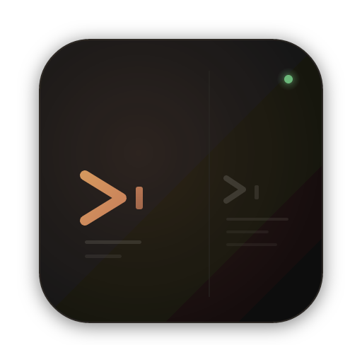

<p align="center">
  
</p>

<h1 align="center">Mini-Term</h1>

<p align="center">
  <strong>为 AI 时代打造的桌面终端管理器</strong><br>
  基于 Tauri v2 · 多项目 · 多标签 · 分屏布局 · AI 进程感知
</p>

<p align="center">
  
  
  
  
  
</p>

---

## 解决痛点

1. **重量级工具多余** — All In AI 的用户只需要终端跑 Agent，却不得不打开 VS Code / IDEA 等重型 IDE，大且占内存
2. **多 Agent 并发无感知** — 同时开多个 Claude / Codex 会话，某个 Agent 跑完了无法直观看到
3. **项目切换不便** — 系统终端缺少多项目组织、标签页和分屏管理能力

Mini-Term 用一个轻量桌面应用解决以上所有问题。

## 预览


## 功能特性

### 终端核心

- **多标签管理** — 每个项目独立标签页，拖拽排序，状态图标一目了然
- **递归分屏** — 横向 / 纵向任意嵌套分屏，Allotment 拖拽调整比例
- **高性能渲染** — xterm.js v6 + WebGL 加速，自动降级为 Canvas
- **10 万行滚动缓冲** — 拦截 CSI 3J（ED3）指令，Claude / Codex 等 TUI 清屏时保留上滚历史
- **终端缓存** — 切换标签 / 分屏不重建 xterm 实例，已有内容不丢失
- **复制粘贴** — `Ctrl+Shift+C` / `Ctrl+Shift+V` 快捷键 + 右键菜单，未选中时"复制"自动置灰
- **文件拖拽** — 文件拖到终端自动插入绝对路径
- **多 Shell 配置** — Windows（cmd / powershell / pwsh）、macOS（zsh / bash）、Linux（bash / sh）等，可自由增删

### AI 进程感知

- **实时状态检测** — 500ms 轮询子进程名，自动识别 Claude / Codex，显示 idle / working / error 状态
- **状态聚合** — 面板 → 标签页 → 项目逐层聚合，优先级 `error > ai-working > ai-idle > idle`
- **完成提醒三件套** — AI 任务从 working → idle 时立刻触发：
  - 右下角 Toast 桌面通知（仅非活跃项目弹出，同项目去重）
  - 项目列表 DONE 徽章，点击清除
  - 任务栏闪烁（Windows）/ Dock 跳动（macOS），窗口失焦时才触发
  - 三个开关独立可配
- **会话进出检测** — 命令 echo 识别进入 AI；双击 `Ctrl+C` / `Ctrl+D` 或 `exit` / `quit` / `:quit` / `/logout` 识别退出
- **会话历史** — 读取本地 Claude / Codex 历史会话记录，右键复制恢复命令快速续接

### 项目管理

- **项目列表** — 左侧边栏管理多个项目目录，一键切换工作区
- **嵌套分组** — 最多 3 级项目分组，拖拽排序，折叠 / 展开
- **文件树** — 集成目录浏览器，`.gitignore` 过滤，`notify` 文件监听实时刷新
- **文件操作** — 文件树内新建文件 / 文件夹、重命名、查看内容（二进制与超大文件友好提示）

### Git 集成

- **文件状态** — 文件树显示 Git 状态颜色（修改 / 新增 / 删除 / 冲突）
- **变更 Diff** — 工作区文件变更的详细 Diff，Hunk 行级解析，并排 / 内联双视图
- **提交历史** — 浏览仓库提交记录，游标分页加载（默认 30 条）
- **提交 Diff** — 查看任意提交的文件变更，逐文件切换
- **分支信息** — 本地 / 远程分支列表
- **Pull / Push** — 仓库行内按钮一键同步远端
- **多仓库发现** — 自动扫描项目目录下所有 Git 仓库（递归 5 层，跳过 `node_modules` 等）


### 外观与配置

- **三种主题模式** — Auto（跟随系统）/ Light / Dark，深色基于 Warm Carbon 暖炭色调，自定义 CSS 变量体系
- **字体独立调节** — UI 与终端字号分别可调（10-20px），终端可选是否跟随 UI 主题
- **布局持久化** — 分屏比例、标签页、窗口大小 / 位置自动保存，重启恢复（`tauri-plugin-window-state`）
- **关闭确认** — 关闭窗口前二次确认，并 flush 所有项目布局，避免误操作
- **版本检查** — 启动时拉取 GitHub Release，标题栏显示新版本提示
- **设置中心** — 统一的 SettingsModal 管理主题、字体、Shell、AI 通知等所有开关

## 技术栈

| 层 | 技术 |
|---|---|
| 框架 | Tauri v2（Rust 后端 + WebView 前端） |
| 前端 | React 19 + TypeScript 5.8 + Tailwind CSS v4 + Vite 7 |
| 终端 | xterm.js v6（WebGL addon，Canvas 降级） |
| 状态 | Zustand（全局单一 Store） |
| 布局 | Allotment（三栏主布局 + 递归 SplitNode 分屏树） |
| PTY | portable-pty 0.8 |
| Git | git2 0.19 |
| 文件监听 | notify 7 + ignore 0.4（.gitignore 过滤） |
| Tauri 插件 | `window-state` · `clipboard-manager` · `dialog` · `opener` |
| 测试覆盖 | 37 个 Rust 单元测试（pty / fs / config） |

## 快速开始

### 直接下载

前往 [Releases](https://github.com/dreamlonglll/mini-term/releases) 页面下载最新安装包。

> Tauri bundle targets = `all`，覆盖 Windows、macOS、Linux 三大桌面平台。

### 从源码构建

#### 前置条件

- [Node.js](https://nodejs.org/) >= 18
- [Rust](https://www.rust-lang.org/tools/install) >= 1.70
- [Tauri v2 CLI](https://v2.tauri.app/start/prerequisites/)

#### 安装与运行

```bash
# 克隆仓库
git clone https://github.com/dreamlonglll/mini-term.git
cd mini-term

# 安装依赖
npm install

# 启动完整 Tauri 开发环境（前端 + 后端）
npm run tauri dev

# 构建发布包
npm run tauri build
```

## 项目结构

```
mini-term/
├── src/                          # 前端源码
│   ├── App.tsx                   # 三栏主布局入口 + 窗口事件
│   ├── store.ts                  # Zustand 全局状态 + 持久化
│   ├── types.ts                  # 类型定义（Pane / Tab / Project / SplitNode ...）
│   ├── styles.css                # 全局样式 + CSS 变量（Warm Carbon）
│   ├── components/
│   │   ├── ProjectList.tsx       # 项目列表 + 嵌套分组 + DONE 徽章
│   │   ├── SessionList.tsx       # AI 会话历史列表（Claude / Codex）
│   │   ├── FileTree.tsx          # 文件目录树 + Git 状态 + 新建 / 重命名
│   │   ├── TerminalArea.tsx      # 标签管理 + 分屏树操作
│   │   ├── SplitLayout.tsx       # 递归渲染 SplitNode 分屏树
│   │   ├── TerminalInstance.tsx  # xterm.js 实例 + 右键菜单 + 文件拖拽
│   │   ├── TabBar.tsx            # 标签栏
│   │   ├── GitHistory.tsx        # Git 仓库树 + 提交历史 + Pull / Push
│   │   ├── CommitDiffModal.tsx   # 提交 Diff 查看器
│   │   ├── DiffModal.tsx         # 工作区文件 Diff 查看器
│   │   ├── FileViewerModal.tsx   # 文件内容查看器
│   │   ├── SettingsModal.tsx     # 设置弹窗（主题 / 字体 / Shell / AI 通知）
│   │   ├── ToastContainer.tsx    # AI 完成 Toast 通知
│   │   ├── DoneTag.tsx           # 项目列表 DONE 徽章
│   │   └── StatusDot.tsx         # 状态指示点
│   ├── hooks/
│   │   └── useTauriEvent.ts      # Tauri 事件订阅封装
│   └── utils/
│       ├── contextMenu.ts        # 右键菜单 DOM 实现
│       ├── dragState.ts          # 项目树拖拽状态
│       ├── projectTree.ts        # 项目树递归操作
│       ├── terminalCache.ts      # xterm 缓存 + 复制粘贴
│       ├── themeManager.ts       # 主题切换 + 系统配色监听
│       └── updateChecker.ts      # GitHub Release 版本检查
├── src-tauri/                    # Rust 后端
│   └── src/
│       ├── lib.rs                # Tauri 初始化与命令 / 插件注册
│       ├── pty.rs                # PTY 生命周期 + AI 会话识别
│       ├── process_monitor.rs    # 子进程状态轮询（500ms）
│       ├── config.rs             # 配置持久化 + 版本迁移
│       ├── fs.rs                 # 目录列表 / 监听 / 新建 / 重命名
│       ├── git.rs                # Git 操作（状态 / Diff / Log / Pull / Push）
│       └── ai_sessions.rs        # Claude / Codex 会话记录读取
└── package.json
```

## 架构概览

### 数据流

```
用户键入 → xterm.onData → invoke('write_pty') → Rust PTY writer
Rust PTY reader → 16ms 批量缓冲 → emit('pty-output') → term.write()
进程退出       → emit('pty-exit')          → store.updatePaneStatusByPty('error')
进程监控 500ms → emit('pty-status-change') → StatusDot 更新
文件变更 notify → emit('fs-change')         → FileTree 刷新
ai-working → ai-idle → Toast + DONE Tag + requestUserAttention
```

### Tauri 接口一览

- **Commands（23 个）** — PTY: `create_pty` · `write_pty` · `resize_pty` · `kill_pty`；FS: `list_directory` · `read_file_content` · `watch_directory` · `unwatch_directory` · `create_file` · `create_directory` · `rename_entry`；Git: `get_git_status` · `get_git_diff` · `discover_git_repos` · `get_git_log` · `get_repo_branches` · `get_commit_files` · `get_commit_file_diff` · `git_pull` · `git_push`；Config: `load_config` · `save_config`；AI: `get_ai_sessions`
- **Events（后端 → 前端）** — `pty-output` · `pty-exit` · `pty-status-change` · `fs-change`

### 状态优先级

终端面板状态从叶节点聚合到标签页和项目级别：

```
error > ai-working > ai-idle > idle
```

### 布局模型

```
App (Allotment 三栏)
├── 左栏：ProjectList（项目 + 分组 + 会话 + DONE 徽章）
├── 中栏：FileTree（目录浏览 + Git 状态 + 文件操作）
└── 右栏
    ├── TabBar（标签管理）
    ├── SplitLayout（递归 SplitNode 分屏树）
    │   └── TerminalInstance × N（xterm.js + 右键菜单）
    └── GitHistory（仓库树 + 提交历史 + Pull/Push）

ToastContainer 悬浮于右下角，SettingsModal 覆盖全局。
```

## 推荐开发环境

- [VS Code](https://code.visualstudio.com/) + [Tauri](https://marketplace.visualstudio.com/items?itemName=tauri-apps.tauri-vscode) + [rust-analyzer](https://marketplace.visualstudio.com/items?itemName=rust-lang.rust-analyzer)

## 贡献

欢迎提交 Issue 和 PR。外部贡献会经过功能验证和安全审查后合并。

提交代码前请运行：

```bash
# 前端类型检查
npm run build

# Rust 测试与构建
cd src-tauri && cargo test && cargo build
```

## 社区

学 AI，上 L 站 — [LinuxDO](https://linux.do/)
